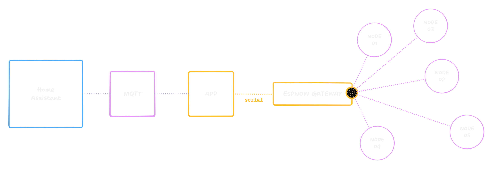

# ESPNOW2MQTT

A MQTT gateway that converts ESPNOW packets to MQTT messages and supports Home Assistant discovery.

<div style="background:#111; padding:8px; display:inline-block; border-radius:12px;">
  
</div>


## Usage

```bash
pnpm install
```

```bash
pnpm start
```

## Demo

https://github.com/tanishqmanuja/static/raw/refs/heads/main/assets/espnow2mqtt/demo.webm